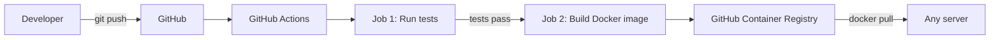

# Sensor API — CI/CD Pipeline


A REST API that collects and analyzes smart home sensor readings (temperature, humidity), delivered through a fully automated CI/CD pipeline: every push is tested, containerized and published without manual steps.

## Architecture



If the tests fail, the image is **not** built or published.

## Tech Stack

| Tool | Purpose |
|---|---|
| **Python / FastAPI** | REST API with automatic data validation and documentation |
| **Pytest** | Automated tests |
| **Docker** | Containerization (slim image, non-root user) |
| **GitHub Actions** | CI/CD pipeline |
| **GitHub Container Registry** | Docker image hosting |

## API Endpoints

| Method | Endpoint | Description |
|---|---|---|
| GET | `/health` | Health check |
| POST | `/readings` | Add a sensor reading |
| GET | `/readings` | List readings (optional filter: `?sensor_id=`) |
| GET | `/readings/{sensor_id}/stats` | Count, average, min and max temperature for a sensor |

Interactive documentation is available at `/docs` once the API is running.

## Quick Start

Run the published image (requires only Docker):

```bash
docker run -d -p 8000:8000 --name sensor-api ghcr.io/chihebchouikh/sensor-api:latest
```

Then open http://localhost:8000/docs

Example request:

```bash
curl -X POST http://localhost:8000/readings \
  -H "Content-Type: application/json" \
  -d '{"sensor_id": "living-room", "temperature": 22.5, "humidity": 45}'
```

## Local Development

```bash
git clone git@github.com:chihebchouikh/sensor-api-cicd.git
cd sensor-api-cicd
python3 -m venv .venv
source .venv/bin/activate
pip install -r requirements.txt

# Run the tests
python -m pytest -v

# Run the API
uvicorn app.main:app --reload
```

Build the image locally:

```bash
docker build -t sensor-api:local .
docker run -d -p 8000:8000 sensor-api:local
```

## CI/CD Pipeline

Defined in [`.github/workflows/ci.yml`](.github/workflows/ci.yml):

1. **Trigger**: every push or pull request on `main`
2. **Test job**: installs Python 3.12 and dependencies, runs the test suite
3. **Build & push job**: runs only if tests pass and only on push; builds the Docker image and publishes it with two tags:
   - `latest`: most recent version
   - commit SHA: exact version traceability and easy rollback

Authentication uses the temporary `GITHUB_TOKEN`: no password is stored in the repository.

## Project Structure

```
sensor-api-cicd/
├── .github/workflows/ci.yml   # CI/CD pipeline
├── app/
│   ├── __init__.py
│   └── main.py                # API code
├── tests/
│   └── test_main.py           # Automated tests
├── Dockerfile                 # Image recipe
├── .dockerignore
├── requirements.txt           # Python dependencies
└── README.md
```

## Roadmap

- [ ] Persistent storage with PostgreSQL (Docker Compose)
- [ ] Security scan of the image with Trivy
- [ ] Deployment on Kubernetes (k3s) with ArgoCD
- [ ] Monitoring with Prometheus and Grafana

## Author

**Chiheb Eddine Chouikh** — Cloud & Network Engineer
[LinkedIn](https://linkedin.com/in/chiheb-chouikh) · [GitHub](https://github.com/chihebchouikh)